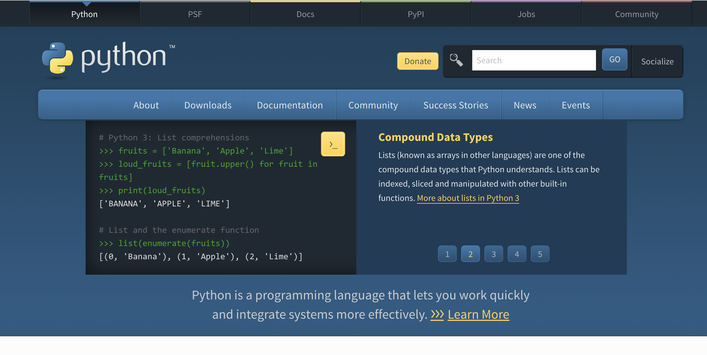
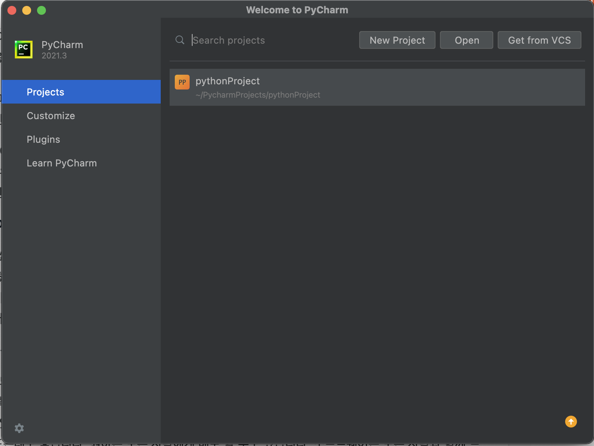

 

새해라고 코드잇의 강의 풀커리를 신청했당
 올해보다 더 머쨍이 개발자가 되어야지 하는 느낌으루,, 다가
 근데 생각보다 너무 기초부터 시작해서 이걸 해야하나 싶지만
 뭐든 기초가 중요한거 아니겠습니까! 

파이썬 오랜만에 보는 셈 치고 #가보자고

 

## 파이썬 설치하기
### 1. 파이썬 인터프리터 설치
 

기본적으로 새로운 언어를 사용할 때 먼저 언어 설치!

https://www.python.org/

여길로 들어가서 다운로드에서 최신버전 설치하면 된다
 
참고로 내가 현재 설치한 버전은 3.10.1
  
아웅 마크다운 너무 어렵네,, ㅜㅜ 
 
 
 

### 2. 파이썬 IDE 설치
 
원래는 인터프리터 설치 되면서 자동으로 깔리는 IDE가 있긴 하댜,, 
 하지만 우리에게는 파이참이라는..! 더 깔끔하고 멋진 IDE가 있죠 후후,, 
 학교 다닐때는 아나콘다 썼던듯? 맞나 ･ᴥ･ 기억이 잘 안나 ㅎ
  
파이참은.. JetBrains 사가 만든 IDE!
 참고로 JetBrains에서는 파이참 뿐만 아니라 다른 IDE도 많습니당 ㅎㅎ
 대표적으로 많이쓰이는게 인텔리제이라는 자바 통합 IDE
 아 참고로 저는 vs code만 씁니다.. ㅎ
  
아니 근데 이거 왜 마크타운이 자기 맘대로인가요.. 내가 줄바꿈을 뭔가 잘못하고 있는거 같당 흑흑

다른사람들이 블로그 글 올린거를 보고 마크다운 문법을 한번 살펴봐야겠서 ㅜ

어쨌든!

https://www.jetbrains.com/ko-kr/pycharm/download/#section=mac

여기서 깔아줍니당 
내가 맥이라서 맥으로 된듯 ㅎ 들어가면 윈도우도 있어요~ 
뭐 항상 그렇듯이 커뮤니티 에디션이면 충분하죠 

IDE같은거나 게임엔진 설치할 때 하는 생각:  
개발자들은 참 친절하다...  
오픈소스에다가 엔진들도 무료배포,,  
어도비 보고있니? 

오쨌든 
 

 
기본 설정 다 하고 요런 머쩅이 화면이 뜬다면 성공..!  

이제 새로운 프로젝트 시작으로 파이썬 코드를 짤 수 있습니다 ㅎㅎ  

 
 

--- 
 
몬가 넘넘 기본적인걸 하고있는 느낌이라서 약간 부끄럽네요ㅎ,,

구래도 기초 중요..! 아마도? 
솔직히 이건 초보초보! 느낌이라서,, 저는 걍 마크다운에 익숙해지려고 쓰는건데.. 
꽤나 어렵네 ㅜ  
왠지 모르겠는데 볼드체도 잘 안되고 줄바꿈도 아직도 잘 모르겠고 
혹시 비주얼 스튜디오 코드 문제인가? 

+사진 넣는거 포스트별로 폴더를 만들어야 하나? 싶고.. 

저거 위에 +도 앞에 하니까 목록으로 되서ㅋㅋㅋㅋㅋ + 다음에 띄어쓰기 하고싶은데 못하고..  
여러모로 어렵군요,, 열심히 쓰면서 공부해야겠슴댜 ･ᴥ･

파이썬 이런것도 해야하나? 싶은거는 다음 포스팅에.. 
넘 쉽긴 해서,, 안쓰고 싶으면 안쓸듯ㅎ 

